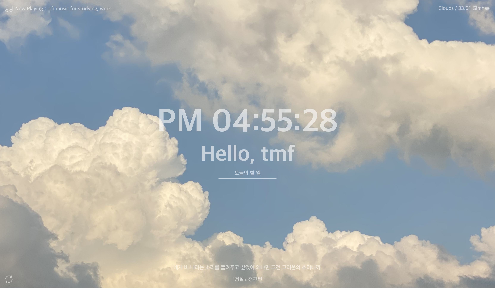

# Momentum 크롬 앱 클론

### 크롬 확장 프로그램 'Momentum'을 클론한 프로젝트입니다.

이 프로젝트는 원본 Momentum 앱의 주요 기능을 복제하여 할 일 목록, 날씨 정보, 시계, 인용 문구, YouTube 음악 재생 기능을 구현합니다.

## 포함된 기능

- **시계 및 인사말:** 현재 시간을 실시간으로 표시하며, `localStorage`를 사용하여 입력된 사용자 이름을 저장하고 인사말을 표시합니다.
- **할 일 목록(To-Do List):** 사용자가 할 일을 추가 및 삭제할 수 있으며, 할 일 목록은 `localStorage`에 저장되어 새로고침 후에도 유지됩니다.
- **명언 및 날씨 정보:** 랜덤 명언을 표시하고, `**Geolocation API**`를 사용해 사용자의 위치 정보를 받아 `**OpenWeather API**`를 통해 실시간 날씨 정보를 제공합니다.
- **배경 이미지:** 다양한 랜덤 배경 이미지가 설정되어 동적으로 배경이 변경됩니다.
- **YouTube 음악 플레이어:** `**YouTube iFrame API**`를 사용하여 YouTube에서 제공하는 Lofi 음악을 재생하거나 일시정지할 수 있는 기능을 제공합니다.
- **밈 메이커:** 연필 아이콘을 클릭하면 [밈 메이커](https://miseullang.github.io/VanillaJSCanvas/)로 이동합니다. 마우스를 사용하여 그림을 그리고, 이미지 업로드 및 다운로드를 지원합니다.

## 사용 기술

## 프로젝트 미리보기

## 참고

- YouTube API를 사용한 음악 재생 기능은 인터넷 연결이 필요합니다.
- 날씨 정보는 사용자의 위치 접근 권한이 허용되어야 동작합니다.

---

이 README에 추가하거나 수정할 내용이 있으면 알려주세요🍀